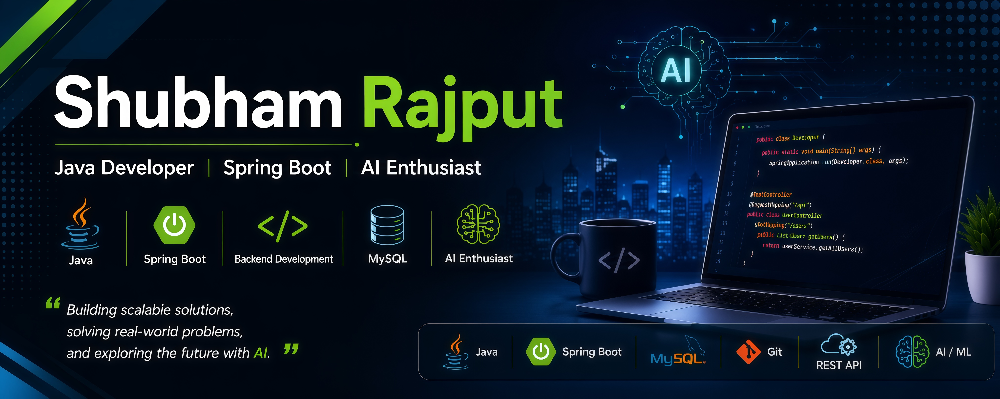

# 👋 Hi, I'm Shubham Rajput

## ☕ Java Developer | Spring Boot | AI Enthusiast

I am a passionate backend developer focused on building scalable, secure, and efficient applications using Java and Spring Boot.

I enjoy designing REST APIs, working with databases, and exploring AI-powered solutions.

---

## 🚀 About Me

- 💻 Backend Developer specializing in Java ecosystem
- 🌱 Currently improving my skills in Spring Boot, System Design & AI
- 🔐 Interested in secure and scalable backend architectures
- 🤖 Exploring AI integration with modern applications
- 🎯 Goal: Build impactful software solutions

---

## 🛠️ Skills & Technologies

### Languages
☕ Java  
🐍 Python  
💻 SQL  

### Backend Development
🌱 Spring Boot  
🔗 REST APIs  
🔒 Spring Security  
🧩 Hibernate / JPA  
🏗️ MVC Architecture  

### Database
🗄️ MySQL  
📊 Database Design  

### Tools
🐙 Git & GitHub  
📮 Postman  
🛠️ Maven  
💻 IntelliJ IDEA  

### AI
🤖 AI Integration  
📚 RAG Concepts  
🧠 LLM Applications  

---

## 🚀 Featured Projects

### 🌐 Seva Nidhi
**Government Scheme Tracking Platform**

- Developed a Spring Boot based backend application for tracking government schemes.
- Implemented REST APIs with search and filtering functionality.
- Integrated MySQL database using Hibernate/JPA.
- Designed structured backend modules following MVC architecture.

**Tech Stack:**  
Java | Spring Boot | Hibernate | JPA | MySQL | REST API

---

### 🚗 NeuroFleetX
**Smart Mobility Management System**

- Developed backend modules for a smart mobility platform using Java and Spring Boot.
- Implemented REST APIs and MySQL database operations.
- Worked on real-time vehicle tracking and analytics.
- Built efficient backend services for mobility management.

**Tech Stack:**  
Java | Spring Boot | MySQL | REST API | Hibernate

---
## 📊 GitHub Stats

---

## 🏆 Achievements

- 🥇 Solved problems on Data Structures & Algorithms
- 🚀 Built backend projects using Spring Boot
- 📚 Continuous learner in software development

---

## 🤝 Connect With Me

📧 Email: shubhamparmarp70@gmail.com
💼 LinkedIn: https://www.linkedin.com/in/shubham-rajput-b93142306

---

⭐ Thanks for visiting my profile!

